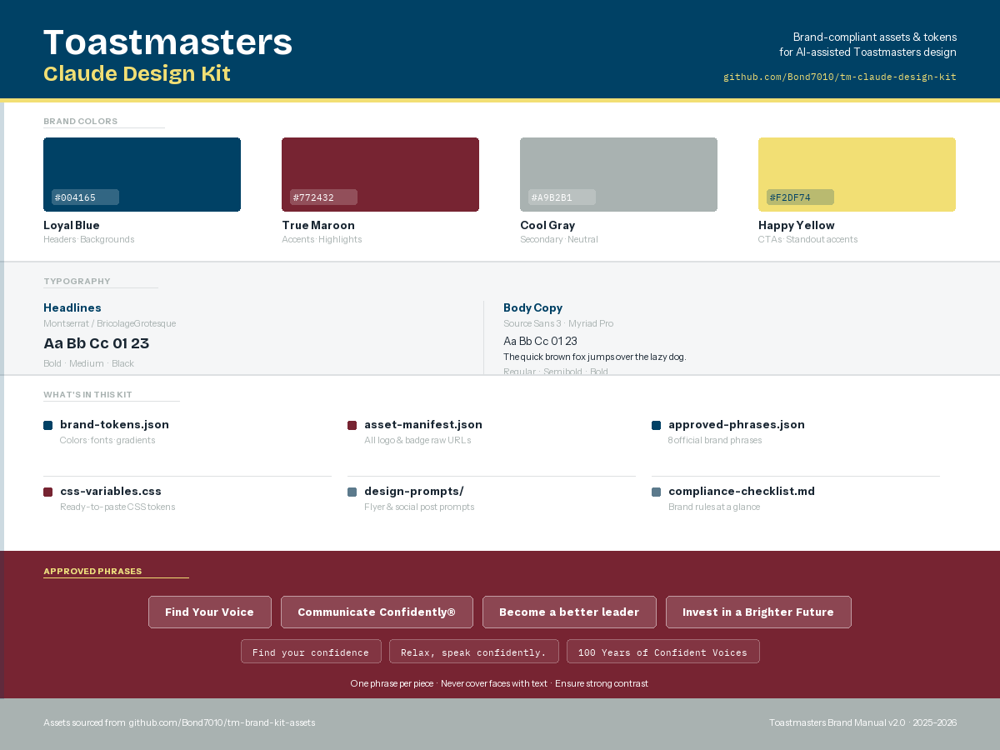
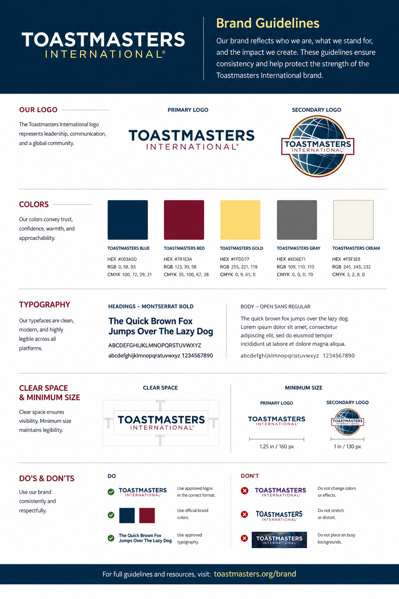

# Toastmasters Claude Design Kit

Structured brand tokens, asset manifests, and design prompts for AI-assisted Toastmasters design work. Companion to [tm-brand-kit-assets](https://github.com/Bond7010/tm-brand-kit-assets).





---

## What's in this kit

| File | What it gives you |
|---|---|
| [`brand-tokens.json`](brand-tokens.json) | Colors, gradients, typography, logo rules — all brand data in one place |
| [`asset-manifest.json`](asset-manifest.json) | Every logo, badge, photo, and template with raw GitHub URLs |
| [`approved-phrases.json`](approved-phrases.json) | 8 official brand phrases tagged by use case |
| [`css-variables.css`](css-variables.css) | Ready-to-paste CSS custom properties + utility classes |
| [`compliance-checklist.md`](compliance-checklist.md) | Pre-publish brand compliance checklist |
| [`CLAUDE.md`](CLAUDE.md) | Instructions for Claude — brand rules, asset patterns, contacts |
| [`design-prompts/`](design-prompts/) | Prompt templates for flyers, social posts, and FTH homepages |

## How to use with Claude

1. **Add this repo to Claude's context** — reference `CLAUDE.md` at the start of any design session so Claude knows the rules without re-briefing.
2. **Point to `brand-tokens.json`** for exact hex codes, font stacks, and gradient definitions.
3. **Use `asset-manifest.json`** to get the right logo variant URL without guessing file paths.
4. **Use a prompt template** from `design-prompts/` and fill in your club's details.

## Asset source

All assets are hosted in the companion repo:

```
https://raw.githubusercontent.com/Bond7010/tm-brand-kit-assets/main/<path>
```

See `asset-manifest.json` for the complete index.

## Brand contacts

| Purpose | Contact |
|---|---|
| Brand questions | brand@toastmasters.org |
| Trademark questions | trademarks@toastmasters.org |
| Brand portal (assets) | toastmasters.org (member login) |

---

*Based on Toastmasters International Brand Manual v2.0 / 2025–2026*
